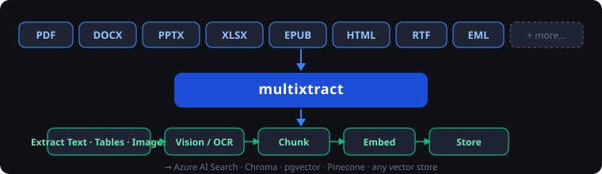
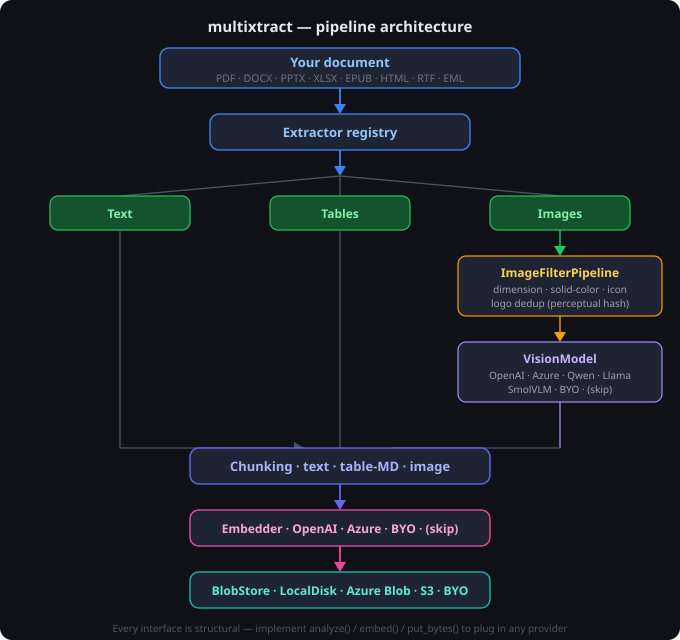

# multixtract — Vendor-neutral document extraction, OCR, chunking, and embeddings for RAG pipelines

[](https://github.com/srivnamrata/multixtract/actions/workflows/ci.yml)
[](https://codecov.io/gh/srivnamrata/multixtract)
[](https://pypi.org/project/multixtract/)
[](https://pypi.org/project/multixtract/)
[](https://pypi.org/project/multixtract/)
[](https://srivnamrata.github.io/multixtract/)
[](https://opensource.org/licenses/MIT)
[](https://github.com/astral-sh/ruff)
[](https://mypy-lang.org/)

Pull **text, tables, and images** out of PDFs, Word, PowerPoint, Excel/CSV and more — let any **vision model** describe the images, **chunk** everything for retrieval, **embed** it, and store the result anywhere.

The core is tiny (just `Pillow` + `ImageHash`). Every format parser and every cloud SDK is an optional extra — install only what you need.



---

## Highlights

✅ **Vendor-neutral** — swap OpenAI for Azure, Qwen, Llama, or your own model with one line  
✅ **Extract text, tables, and images** from 15+ file formats  
✅ **Modular** — use only extraction, or run the full extract → vision → chunk → embed → store pipeline  
✅ **Fully offline** — local vision models, no API key, no cloud  
✅ **Tiny core install** — only Pillow + ImageHash; every heavy dependency is optional  
✅ **Fully typed** — mypy and pyright compatible out of the box  

---

## Why Multixtract?

Most libraries optimise for one part of the workflow — parse documents, run OCR, generate embeddings, or store vectors. You end up stitching together five packages with incompatible interfaces and rebuilding the same pipeline on every project.

multixtract connects all of them without locking you into a provider. Swap OpenAI for Azure or a local model, swap Azure Blob for S3, add a new file format — none of it touches the rest of the pipeline.

> **What multixtract is not:** It is not a vector database, retrieval framework, or chat system. It focuses on document ingestion and preparation — getting clean, structured, chunked content into whatever AI system you're building.

| Feature | **multixtract** | Unstructured | Docling |
|---|---|---|---|
| PDF | ✅ | ✅ | ✅ |
| DOCX | ✅ | ✅ | ✅ |
| PPTX | ✅ | ✅ | ✅ |
| XLSX / CSV | ✅ | Partial | ❌ |
| EPUB / RTF / HTML / Email | ✅ | Partial | ❌ |
| Vendor-neutral vision model | ✅ | ❌ | ❌ |
| Bring your own embeddings | ✅ | ❌ | ❌ |
| Bring your own storage backend | ✅ | Partial | Partial |
| Fully modular pipeline | ✅ | Partial | Partial |
| Optional dependencies | ✅ | ❌ | ❌ |
| Offline / no-cloud mode | ✅ | ❌ | Partial |
| Core install size | **Pillow + ImageHash** | Heavy | Heavy |

---

## Quick Start

```bash
pip install "multixtract[pdf,docx,pptx,xlsx]"
```

One call. Any document. Done.

```python
from multixtract import Pipeline

Pipeline().process("report.pdf")                      # extract → filter → chunk
Pipeline().process("report.pdf", split_chunks=True)   # + write individual chunk files
```

Or stay close to the data:

```python
from multixtract import extract_document, chunk_document

document, images = extract_document("report.pdf")
chunks = chunk_document(document, base_name="report")
```

**Supported formats:** PDF · DOCX · PPTX · XLSX · CSV · EPUB · HTML · RTF · Email · Images · Plain text · Markdown — and legacy `.doc` / `.ppt` via LibreOffice.

**Vision providers:** OpenAI · Azure OpenAI · Qwen2.5-VL · Llama 3.2 Vision · SmolVLM (CPU) · bring your own.

→ [Full installation guide](https://srivnamrata.github.io/multixtract/usage/#install) · [Recipes](docs/recipes/) · [Provider setup](docs/providers/)

---

## Document Schema

Every call to `extract_document` returns the same structure regardless of input format:

```
PDF / DOCX / PPTX / XLSX / …
        │
        ▼
{
  "_base_name": "report",
  "metadata": { "format": "pdf", "page_count": 12, ... },
  "pgs": [
    {
      "pg_num": 1,
      "kind":   "page",
      "title":  "Executive Summary",
      "txt":    "The quarterly results show a 12% increase...",
      "tables": [
        [["Region", "Q1", "Q2"], ["North", "1.2M", "1.4M"], ...]
      ],
      "imgs": [
        { "image_id": "report-p1-img0", "width": 800, "height": 600 }
      ],
      "hyperlinks": ["https://example.com/data"]
    },
    ...
  ]
}
```

→ [Full data model and chunk schema](docs/data-model.md)

---

## Architecture



```
┌─────────────────────────────────────────────────────────────────┐
│                        Your document                            │
│          PDF · DOCX · PPTX · XLSX · EPUB · HTML · RTF …         │
└────────────────────────────┬────────────────────────────────────┘
                             │
                    ┌────────▼────────┐
                    │   Extractors    │  (registry — one per format)
                    └────────┬────────┘
                             │
              ┌──────────────┼──────────────┐
              │              │              │
         ┌────▼────┐   ┌─────▼─────┐  ┌─────▼───┐
         │  Text   │   │  Tables   │  │ Images  │
         └────┬────┘   └─────┬─────┘  └─────┬───┘
              │              │              │
              │              │    ┌─────────▼───────────┐
              │              │    │  ImageFilterPipeline│
              │              │    │  · dimension        │
              │              │    │  · solid-color      │
              │              │    │  · icon rejection   │
              │              │    │  · logo dedup (hash)│
              │              │    └─────────┬───────────┘
              │              │              │
              │              │    ┌─────────▼───────────┐
              │              │    │     VisionModel     │
              │              │    │   OpenAI · Azure    │
              │              │    │  Qwen · Llama · CPU │
              │              │    │  (or skip entirely) │
              │              │    └─────────┬───────────┘
              │              │              │
              └──────────────┴──────────────┘
                             │
                    ┌────────▼────────┐
                    │    Chunking     │  sliding-window · table-MD · image
                    └────────┬────────┘
                             │
                    ┌────────▼────────┐
                    │    Embedder     │  OpenAI · Azure · BYO · (skip)
                    └────────┬────────┘
                             │
                    ┌────────▼────────┐
                    │    BlobStore    │  LocalDisk · AzureBlob · S3 · BYO
                    └─────────────────┘
```

The pipeline talks only to three **interfaces** — it never imports a vendor directly:

| Interface | Job | Built-in implementations |
|---|---|---|
| `VisionModel` | image → caption + OCR + description | `OpenAIVisionModel`, `AzureOpenAIVisionModel`, `Qwen2VLVisionModel`, `SmolVLMVisionModel`, `Llama32VisionModel` |
| `Embedder` | text → vector | `OpenAIEmbedder`, `AzureOpenAIEmbedder` |
| `BlobStore` | save bytes/JSON | `LocalDiskStore`, `AzureBlobStore` |

Add a new format with `register_extractor`. Plug in S3, GCS, or any backend by implementing three methods on `BlobStore`.

---

## Integrations

Multixtract is an **extraction and chunking layer**, not a RAG framework. It fits underneath the tools you already use:

```python
from multixtract import extract_document, chunk_document
from langchain.schema import Document as LCDocument

document, _ = extract_document("report.pdf")
chunks = chunk_document(document, base_name="report")

# LangChain
lc_docs = [LCDocument(page_content=c["content"], metadata={"pg": c["pg_num"]}) for c in chunks]

# LlamaIndex
from llama_index.core import Document as LIDocument
li_docs = [LIDocument(text=c["content"], metadata={"chunk_id": c["chunk_id"]}) for c in chunks]
```


### Example projects

| Integration | What it shows |
|---|---|
| [LangChain + Chroma](examples/langchain_chroma/) | Ingest → Chroma vector store → RetrievalQA |
| [Azure AI Search](examples/azure_ai_search/) | Ingest → hybrid keyword + vector search → GPT-4o answer |
| [LlamaIndex](examples/llamaindex/) | Ingest → LlamaIndex VectorStoreIndex → query engine |
| [pgvector](examples/pgvector/) | Ingest → PostgreSQL + pgvector → cosine similarity search |
| [Semantic Kernel](examples/semantic_kernel/) | Ingest → SK memory store → prompt function RAG |
| [Offline OCR](examples/offline_ocr/) | Tesseract OCR on images — no API key, no cloud, no GPU |

Each example is a self-contained `ingest.py` with a `--query` flag so you can extract, store, and query in one command.

---

## Features

* **Multi-format**: PDF, Word, PowerPoint, Excel/CSV, EPUB, HTML, RTF, email, images (+ legacy `.doc`/`.ppt` via LibreOffice)
* Cross-page image **deduplication** via xref tracking
* **Image filters**: solid-color / tiny-icon / dimension / reference-logo (perceptual hash)
* **Sliding-window** text chunking (~500 tokens, ~50 overlap) at sentence boundaries
* Tables serialized to **Markdown**; images embedded once and reused
* **Parallel** vision calls (`vision_workers`), **batched** embeddings
* Resume support — skip documents already in the store (`skip_if_exists`)
* **Two-stage chunking**: `_chunks.json` written automatically; pass `split_chunks=True` to also write flat individual chunk documents ready for Azure AI Search or any vector store
* `build_index_document()` — transforms a raw chunk into a flat, AI-Search-ready document (renames `embedding` → `content_vector`, flattens `metadata`)
* `safe_index_key()` — sanitizes any string to a valid Azure AI Search document key
* Fully typed — `py.typed` marker, compatible with mypy and pyright

---

## Roadmap

- [x] PDF / DOCX / PPTX / XLSX extraction
- [x] EPUB / HTML / RTF / email extraction
- [x] Azure OpenAI vision + embeddings integration
- [x] Local vision models (Qwen2.5-VL, Llama 3.2, SmolVLM)
- [x] Azure Blob Storage backend
- [x] Sliding-window chunking with sentence-boundary awareness
- [x] Smart image filtering (dimension, solid-color, logo dedup)
- [x] Document-level metadata on every chunk (`file_path`, `doc_id`, `last_updated`, …)
- [x] Individual chunk splitting — `split_chunks=True` or `split_chunks_file()` writes per-chunk documents for AI Search ingestion
- [x] `build_index_document()` — flat AI-Search-optimized output with `content_vector`, flattened `metadata`
- [ ] Figure-caption association (link extracted images to their nearest caption)
- [ ] Table-of-contents aware chunking (respect heading hierarchy)
- [ ] multisense — companion RAG pipeline library built on multixtract

PRs and feature requests welcome via [GitHub Issues](https://github.com/srivnamrata/multixtract/issues).

---

## Performance

Extracts a 50-page PDF in **~4 s** and a 100-slide PPTX in **~0.14 s** on a standard developer machine (no GPU, no API key). Chunking adds negligible overhead.

→ [Full benchmark results and methodology](docs/performance.md)

---

## Documentation

| | |
|---|---|
| [Installation](https://srivnamrata.github.io/multixtract/usage/#install) | Extras, formats, providers |
| [Recipes](docs/recipes/) | OpenAI · Azure · extract-only · chunk-only · offline OCR |
| [Providers](docs/providers/) | OpenAI · Azure · Qwen · SmolVLM · Llama |
| [Data model](docs/data-model.md) | Document schema · chunk schema · metadata fields |
| [Performance](docs/performance.md) | Benchmark results and methodology |
| [Compatibility](docs/compatibility.md) | Python · OS · torch / CUDA combinations |
| [Troubleshooting](docs/troubleshooting.md) | LibreOffice · CUDA · Azure auth · common errors |
| [API Reference](https://srivnamrata.github.io/multixtract/api/) | Full public API |

---

## Contributing

```bash
pip install -e ".[dev,pdf,docx,pptx,xlsx,epub,html,rtf]"
pytest
ruff check src tests
mypy src/multixtract --ignore-missing-imports --no-error-summary
python benchmarks/run_benchmarks.py
```

See [CONTRIBUTING.md](CONTRIBUTING.md) for guidelines. Bug reports and PRs are welcome.

---

## Example Applications

- Internal RAG systems on Azure OpenAI
- Enterprise search over mixed document libraries
- Research document processing pipelines

Using multixtract in your project? [Open a PR](https://github.com/srivnamrata/multixtract/pulls) to add it here.

---

## License

MIT — see `LICENSE`.
